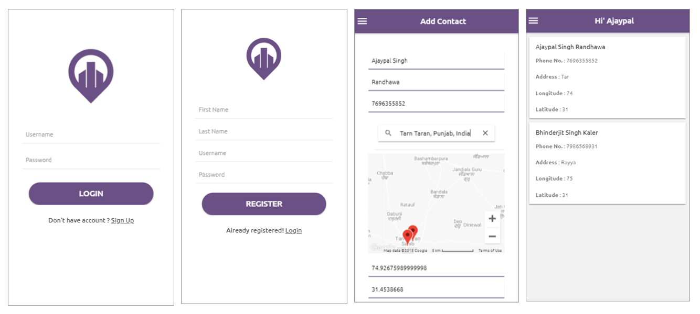

# Ionic3-Php-Rest-API-Address-Book

Ionic3 Php Rest API Address Book is developed in Ionic3 Angular4 & Php Slim Restful API with MySql Database. It is based on Ionic CRUD Operation. Addressbook has functionality like register user, login user, add a contact with mobile number, address, and google map integration with longitude and latitude parameter. The address book has also functionality to checking already registered user. The Address Book has Great UI/ UX.  It has Token Based Restful Authentication.

### Some Validation
1. Username is Mixed (Numeric + Alphabet)
2. Password (Mixed Greator than 4 Character)
3. Unique Username
4. Every Function Execute After Checking Authentication Token

#### Technologies Used

1. Php7
2. Mysql
3. Php Slim (Restful API)
4. Ionic
5. Angular4

#### Wireframing


#### App UI



### Usage 

1. Run Project Using "Ionic Serve"
2. Edit Server API URL in src/providers/auth-service.ts
3. Copy Backend Folder in Xammp (Apache Server).
4. Edit Config.php file and set value of your Apache server, database server, password etc.
5. Restore Database file or Create Database using this Query. And Connect to youur API Config.

```
CREATE TABLE `adbook` (
  `entryid` int(11) NOT NULL,
  `fname` varchar(50) NOT NULL,
  `lname` varchar(50) NOT NULL,
  `mnumber` varchar(50) NOT NULL,
  `address` varchar(100) NOT NULL,
  `user_id` int(20) NOT NULL,
  `lgt` int(50) NOT NULL,
  `ltt` int(50) NOT NULL
) ENGINE=InnoDB DEFAULT CHARSET=latin1;

CREATE TABLE `users` (
  `user_id` int(11) NOT NULL,
  `fname` varchar(100) NOT NULL,
  `lname` varchar(50) NOT NULL,
  `username` varchar(50) NOT NULL,
  `password` varchar(100) NOT NULL
) ENGINE=InnoDB DEFAULT CHARSET=latin1;

ALTER TABLE `adbook`
  ADD PRIMARY KEY (`entryid`);

ALTER TABLE `users`
  ADD PRIMARY KEY (`user_id`);

ALTER TABLE `adbook`
  MODIFY `entryid` int(11) NOT NULL AUTO_INCREMENT, AUTO_INCREMENT=3;

ALTER TABLE `users`
  MODIFY `user_id` int(11) NOT NULL AUTO_INCREMENT, AUTO_INCREMENT=2;
COMMIT;

```

### Authors

 Ajay Randhawa
 
 ### Donate
If you appreciate that, please consider donating to the Developer.

[](https://www.paypal.me/ajayrandhawa) 
